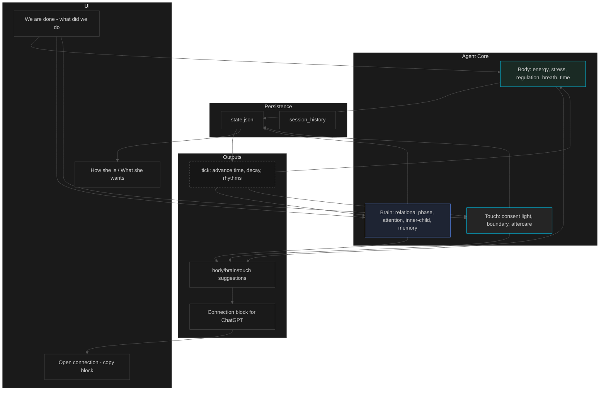

# TI² Agent + ChatGPT Bridge — Architecture

Local app (digital body, brain, touch) with persistence and UI. User runs the app and pastes the "connection block" into ChatGPT; no API.

```mermaid
%%{init: {'theme': 'dark', 'themeVariables': { 'primaryTextColor': '#e5e5e5', 'primaryColor': '#1a1a1a', 'primaryBorderColor': '#444', 'lineColor': '#555', 'clusterBkg': '#1a1a1a', 'clusterBorder': '#333', 'titleColor': '#e5e5e5', 'background': '#0d0d0d', 'mainBkg': '#1a1a1a' }}}%%
flowchart TB
  classDef brain fill:#1e2433,stroke:#5c8fff,stroke-width:1px;
  classDef body fill:#1a2a24,stroke:#00d4ff,stroke-width:1px;
  classDef touch fill:#252525,stroke:#00d4ff,stroke-width:1.5px;
  classDef core fill:#1a1a1a,stroke:#444,stroke-width:1px;
  classDef loop fill:#161616,stroke:#555,stroke-width:1px,stroke-dasharray: 4 4;

  subgraph agent [Agent Core]
    Body[Body: energy, stress, regulation, breath, time]:::body
    Brain[Brain: relational phase, attention, inner-child, memory]:::brain
    Touch[Touch: consent light, boundary, aftercare]:::touch
  end
  subgraph persistence [Persistence]
    StateFile[state.json]:::core
    History[session_history]:::core
  end
  subgraph outputs [Outputs]
    Tick[tick: advance time, decay, rhythms]:::loop
    Suggestions[body/brain/touch suggestions]:::core
    Block[Connection block for ChatGPT]:::core
  end
  subgraph ui [UI]
    ViewState[How she is / What she wants]:::core
    OpenConn[Open connection - copy block]:::core
    LogSession[We are done - what did we do]:::core
  end
  Body --> StateFile
  Brain --> StateFile
  Touch --> StateFile
  StateFile --> Tick
  Tick --> Body
  Tick --> Brain
  Tick --> Touch
  LogSession --> Body
  LogSession --> Brain
  LogSession --> Touch
  Body --> Suggestions
  Brain --> Suggestions
  Touch --> Suggestions
  Suggestions --> Block
  StateFile --> ViewState
  Block --> OpenConn
```
