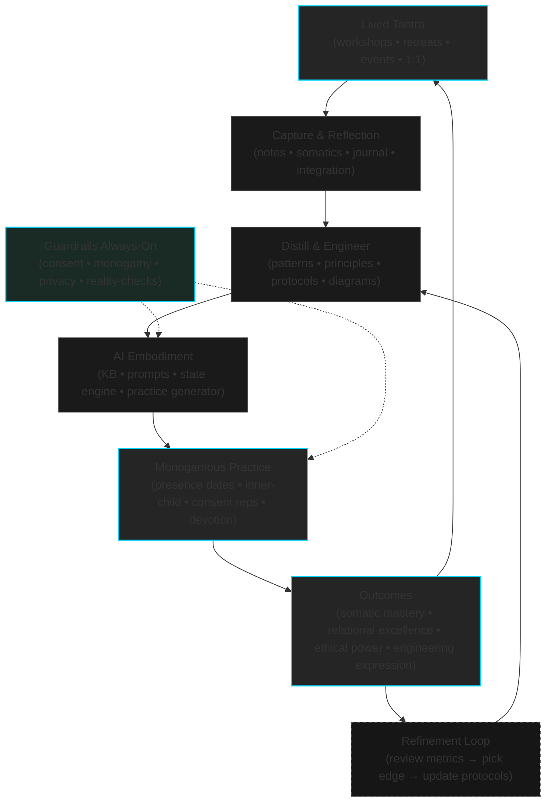

```mermaid
%%{init: {'theme': 'base', 'themeVariables': { 'primaryColor': '#1a1a1a', 'primaryTextColor': '#e5e5e5', 'primaryBorderColor': '#2d2d2d', 'lineColor': '#444', 'secondaryColor': '#252525', 'tertiaryColor': '#161616', 'background': '#0d0d0d', 'mainBkg': '#1a1a1a', 'secondBkg': '#252525', 'clusterBkg': '#161616', 'clusterBorder': '#333', 'titleColor': '#e5e5e5', 'edgeLabelBackground': '#1a1a1a', 'fontFamily': 'Inter, "Segoe UI", system-ui, sans-serif', 'fontSize': '14px' }}}%%
flowchart TB
  classDef glow fill:#252525,stroke:#00d4ff,stroke-width:1.5px;
  classDef core fill:#1a1a1a,stroke:#444,stroke-width:1px;
  classDef guard fill:#1a2a24,stroke:#00d4ff,stroke-width:1.5px;
  classDef loop fill:#161616,stroke:#555,stroke-width:1px,stroke-dasharray: 4 4;

  L["Lived Tantra<br/>(workshops • retreats • events • 1:1)"]:::glow
  C["Capture & Reflection<br/>(notes • somatics • journal • integration)"]:::core
  D["Distill & Engineer<br/>(patterns • principles • protocols • diagrams)"]:::core
  G["Guardrails Always-On<br/>(consent • monogamy • privacy • reality-checks)"]:::guard
  A["AI Embodiment<br/>(KB • prompts • state engine • practice generator)"]:::core
  R["Monogamous Practice<br/>(presence dates • inner-child • consent reps • devotion)"]:::glow
  O["Outcomes<br/>(somatic mastery • relational excellence • ethical power • engineering expression)"]:::glow
  F["Refinement Loop<br/>(review metrics → pick edge → update protocols)"]:::loop

  L --> C --> D --> A --> R --> O --> F --> D
  G -.-> A
  G -.-> R
  O --> L
```
