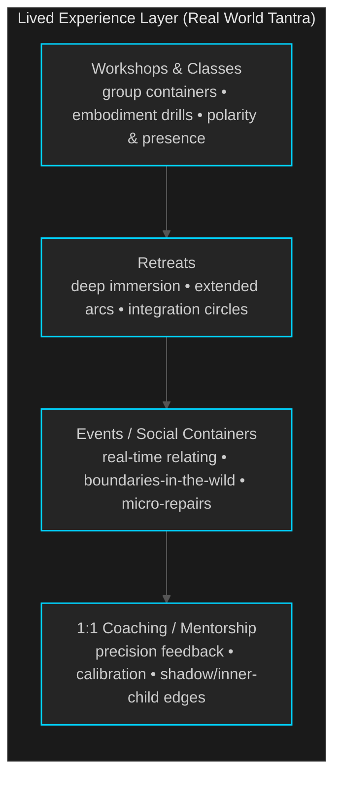

```mermaid
%%{init: {'theme': 'dark', 'themeVariables': { 'primaryTextColor': '#e5e5e5', 'primaryColor': '#1a1a1a', 'primaryBorderColor': '#444', 'lineColor': '#555', 'clusterBkg': '#1a1a1a', 'clusterBorder': '#333', 'titleColor': '#e5e5e5', 'background': '#0d0d0d', 'mainBkg': '#1a1a1a' }}}%%
flowchart TB
  classDef glow fill:#252525,stroke:#00d4ff,stroke-width:1.5px;

  subgraph LIVED["Lived Experience Layer (Real World Tantra)"]
    direction TB
    W["Workshops & Classes<br/>group containers • embodiment drills • polarity & presence"]:::glow
    RT["Retreats<br/>deep immersion • extended arcs • integration circles"]:::glow
    E["Events / Social Containers<br/>real-time relating • boundaries-in-the-wild • micro-repairs"]:::glow
    O["1:1 Coaching / Mentorship<br/>precision feedback • calibration • shadow/inner-child edges"]:::glow
  end

  W --> RT --> E --> O
```
