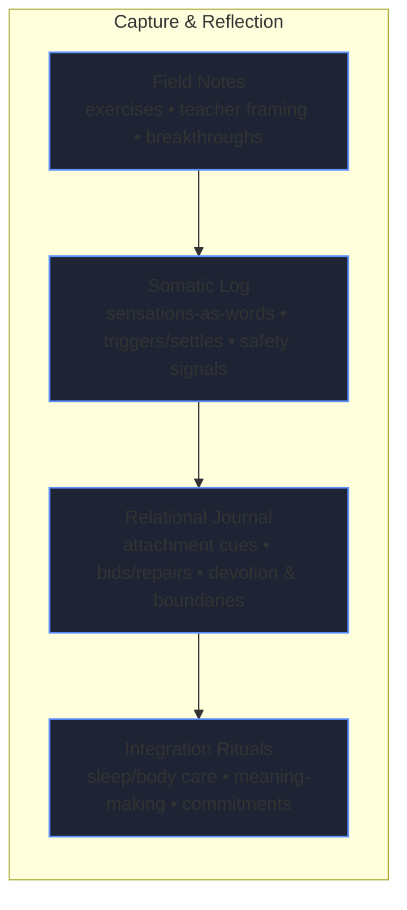

```mermaid
%%{init: {'theme': 'base', 'themeVariables': { 'primaryColor': '#1a1a1a', 'primaryTextColor': '#e5e5e5', 'primaryBorderColor': '#2d2d2d', 'lineColor': '#444', 'secondaryColor': '#252525', 'tertiaryColor': '#161616', 'background': '#0d0d0d', 'mainBkg': '#1a1a1a', 'secondBkg': '#252525', 'clusterBkg': '#161616', 'clusterBorder': '#333', 'titleColor': '#e5e5e5', 'fontFamily': 'Inter, "Segoe UI", system-ui, sans-serif', 'fontSize': '14px' }}}%%
flowchart TB
  classDef art fill:#1e2433,stroke:#5c8fff,stroke-width:1.5px;

  subgraph CAPTURE["Capture & Reflection"]
    direction TB
    N1["Field Notes<br/>exercises • teacher framing • breakthroughs"]:::art
    N2["Somatic Log<br/>sensations-as-words • triggers/settles • safety signals"]:::art
    N3["Relational Journal<br/>attachment cues • bids/repairs • devotion & boundaries"]:::art
    N4["Integration Rituals<br/>sleep/body care • meaning-making • commitments"]:::art
  end

  N1 --> N2 --> N3 --> N4
```
