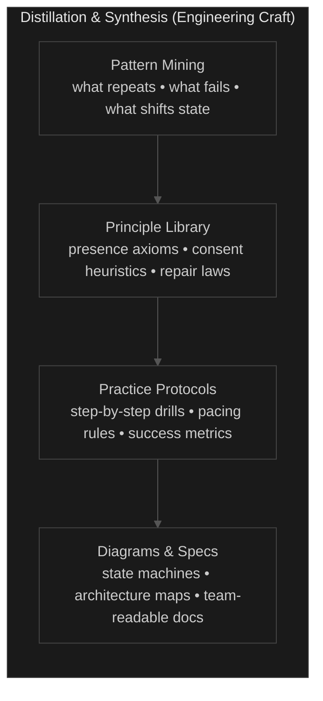

```mermaid
%%{init: {'theme': 'dark', 'themeVariables': { 'primaryTextColor': '#e5e5e5', 'primaryColor': '#1a1a1a', 'primaryBorderColor': '#444', 'lineColor': '#555', 'clusterBkg': '#1a1a1a', 'clusterBorder': '#333', 'titleColor': '#e5e5e5', 'background': '#0d0d0d', 'mainBkg': '#1a1a1a' }}}%%
flowchart TB
  classDef core fill:#1a1a1a,stroke:#444,stroke-width:1px;

  subgraph DISTILL["Distillation & Synthesis (Engineering Craft)"]
    direction TB
    P["Pattern Mining<br/>what repeats • what fails • what shifts state"]:::core
    L["Principle Library<br/>presence axioms • consent heuristics • repair laws"]:::core
    PR["Practice Protocols<br/>step-by-step drills • pacing rules • success metrics"]:::core
    DS["Diagrams & Specs<br/>state machines • architecture maps • team-readable docs"]:::core
  end

  P --> L --> PR --> DS
```
