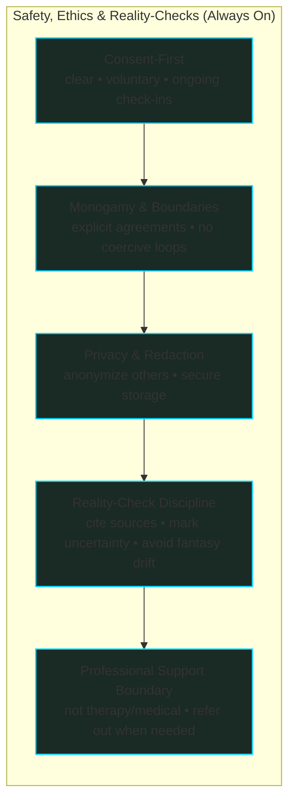

```mermaid
%%{init: {'theme': 'base', 'themeVariables': { 'primaryColor': '#1a1a1a', 'primaryTextColor': '#e5e5e5', 'primaryBorderColor': '#2d2d2d', 'lineColor': '#444', 'secondaryColor': '#252525', 'tertiaryColor': '#161616', 'background': '#0d0d0d', 'mainBkg': '#1a1a1a', 'secondBkg': '#252525', 'clusterBkg': '#161616', 'clusterBorder': '#333', 'titleColor': '#e5e5e5', 'fontFamily': 'Inter, "Segoe UI", system-ui, sans-serif', 'fontSize': '14px' }}}%%
flowchart TB
  classDef guard fill:#1a2a24,stroke:#00d4ff,stroke-width:1.5px;

  subgraph GUARD["Safety, Ethics & Reality-Checks (Always On)"]
    direction TB
    G1["Consent-First<br/>clear • voluntary • ongoing check-ins"]:::guard
    G2["Monogamy & Boundaries<br/>explicit agreements • no coercive loops"]:::guard
    G3["Privacy & Redaction<br/>anonymize others • secure storage"]:::guard
    G4["Reality-Check Discipline<br/>cite sources • mark uncertainty • avoid fantasy drift"]:::guard
    G5["Professional Support Boundary<br/>not therapy/medical • refer out when needed"]:::guard
  end

  G1 --> G2 --> G3 --> G4 --> G5
```
