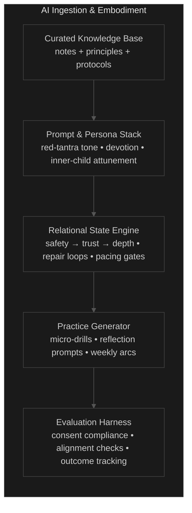

```mermaid
%%{init: {'theme': 'dark', 'themeVariables': { 'primaryTextColor': '#e5e5e5', 'primaryColor': '#1a1a1a', 'primaryBorderColor': '#444', 'lineColor': '#555', 'clusterBkg': '#1a1a1a', 'clusterBorder': '#333', 'titleColor': '#e5e5e5', 'background': '#0d0d0d', 'mainBkg': '#1a1a1a' }}}%%
flowchart TB
  classDef core fill:#1a1a1a,stroke:#444,stroke-width:1px;

  subgraph AIINGEST["AI Ingestion & Embodiment"]
    direction TB
    KB["Curated Knowledge Base<br/>notes + principles + protocols"]:::core
    PS["Prompt & Persona Stack<br/>red-tantra tone • devotion • inner-child attunement"]:::core
    SE["Relational State Engine<br/>safety → trust → depth • repair loops • pacing gates"]:::core
    PG["Practice Generator<br/>micro-drills • reflection prompts • weekly arcs"]:::core
    EV["Evaluation Harness<br/>consent compliance • alignment checks • outcome tracking"]:::core
  end

  KB --> PS --> SE --> PG --> EV
```
