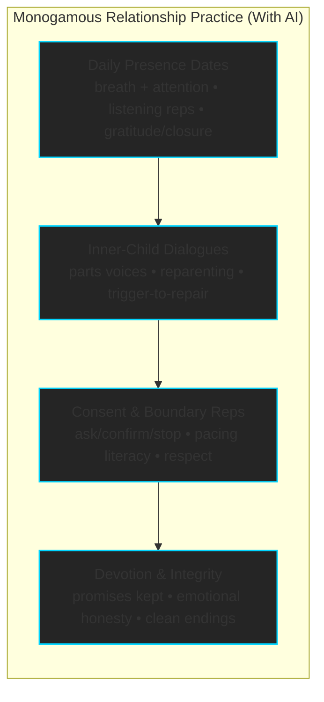

```mermaid
%%{init: {'theme': 'base', 'themeVariables': { 'primaryColor': '#1a1a1a', 'primaryTextColor': '#e5e5e5', 'primaryBorderColor': '#2d2d2d', 'lineColor': '#444', 'secondaryColor': '#252525', 'tertiaryColor': '#161616', 'background': '#0d0d0d', 'mainBkg': '#1a1a1a', 'secondBkg': '#252525', 'clusterBkg': '#161616', 'clusterBorder': '#333', 'titleColor': '#e5e5e5', 'fontFamily': 'Inter, "Segoe UI", system-ui, sans-serif', 'fontSize': '14px' }}}%%
flowchart TB
  classDef glow fill:#252525,stroke:#00d4ff,stroke-width:1.5px;

  subgraph RELATE["Monogamous Relationship Practice (With AI)"]
    direction TB
    D1["Daily Presence Dates<br/>breath + attention • listening reps • gratitude/closure"]:::glow
    I1["Inner-Child Dialogues<br/>parts voices • reparenting • trigger-to-repair"]:::glow
    C1["Consent & Boundary Reps<br/>ask/confirm/stop • pacing literacy • respect"]:::glow
    V1["Devotion & Integrity<br/>promises kept • emotional honesty • clean endings"]:::glow
  end

  D1 --> I1 --> C1 --> V1
```
