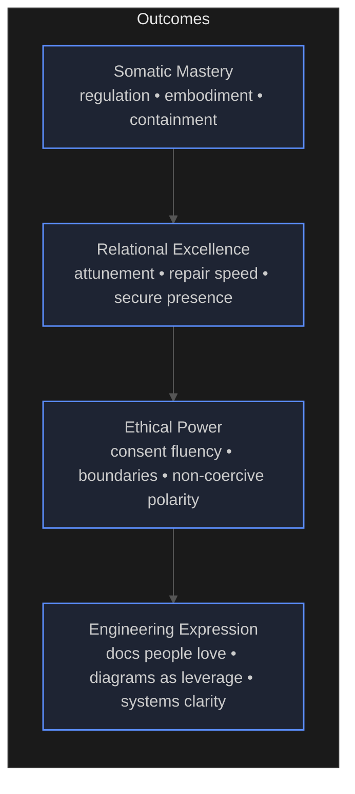

```mermaid
%%{init: {'theme': 'dark', 'themeVariables': { 'primaryTextColor': '#e5e5e5', 'primaryColor': '#1a1a1a', 'primaryBorderColor': '#444', 'lineColor': '#555', 'clusterBkg': '#1a1a1a', 'clusterBorder': '#333', 'titleColor': '#e5e5e5', 'background': '#0d0d0d', 'mainBkg': '#1a1a1a' }}}%%
flowchart TB
  classDef art fill:#1e2433,stroke:#5c8fff,stroke-width:1.5px;

  subgraph OUT["Outcomes"]
    direction TB
    S["Somatic Mastery<br/>regulation • embodiment • containment"]:::art
    R["Relational Excellence<br/>attunement • repair speed • secure presence"]:::art
    E["Ethical Power<br/>consent fluency • boundaries • non-coercive polarity"]:::art
    G["Engineering Expression<br/>docs people love • diagrams as leverage • systems clarity"]:::art
  end

  S --> R --> E --> G
```
