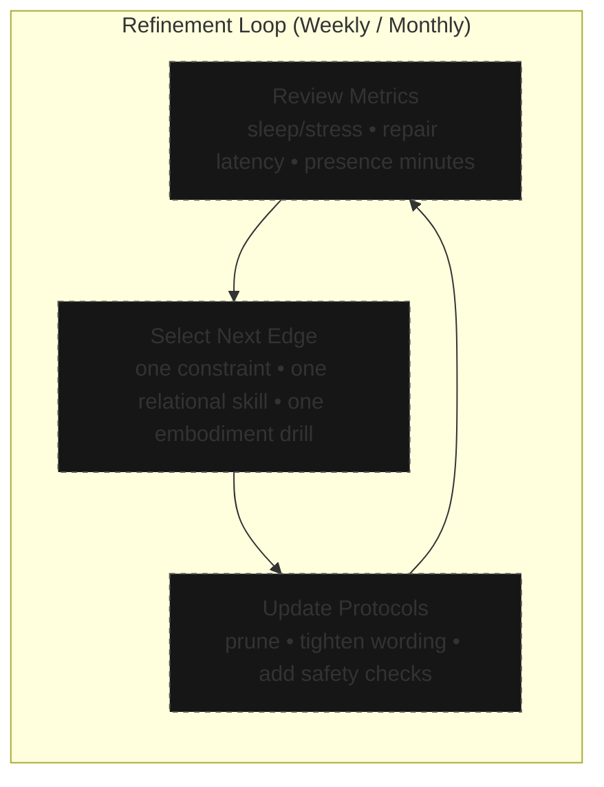

```mermaid
%%{init: {'theme': 'base', 'themeVariables': { 'primaryColor': '#1a1a1a', 'primaryTextColor': '#e5e5e5', 'primaryBorderColor': '#2d2d2d', 'lineColor': '#444', 'secondaryColor': '#252525', 'tertiaryColor': '#161616', 'background': '#0d0d0d', 'mainBkg': '#1a1a1a', 'secondBkg': '#252525', 'clusterBkg': '#161616', 'clusterBorder': '#333', 'titleColor': '#e5e5e5', 'fontFamily': 'Inter, "Segoe UI", system-ui, sans-serif', 'fontSize': '14px' }}}%%
flowchart TB
  classDef loop fill:#161616,stroke:#555,stroke-width:1px,stroke-dasharray: 4 4;

  subgraph REFINE["Refinement Loop (Weekly / Monthly)"]
    direction TB
    M["Review Metrics<br/>sleep/stress • repair latency • presence minutes"]:::loop
    E["Select Next Edge<br/>one constraint • one relational skill • one embodiment drill"]:::loop
    U["Update Protocols<br/>prune • tighten wording • add safety checks"]:::loop
  end

  M --> E --> U --> M
```
