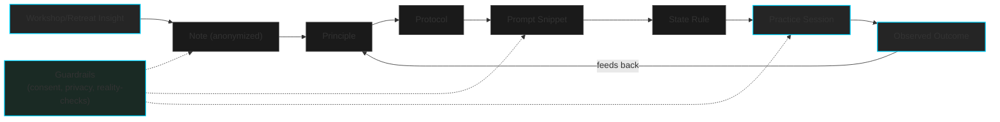

```mermaid
%%{init: {'theme': 'base', 'themeVariables': { 'primaryColor': '#1a1a1a', 'primaryTextColor': '#e5e5e5', 'primaryBorderColor': '#2d2d2d', 'lineColor': '#444', 'secondaryColor': '#252525', 'tertiaryColor': '#161616', 'background': '#0d0d0d', 'mainBkg': '#1a1a1a', 'secondBkg': '#252525', 'clusterBkg': '#161616', 'clusterBorder': '#333', 'titleColor': '#e5e5e5', 'fontFamily': 'Inter, "Segoe UI", system-ui, sans-serif', 'fontSize': '14px' }}}%%
flowchart LR
  classDef glow fill:#252525,stroke:#00d4ff,stroke-width:1.5px;
  classDef core fill:#1a1a1a,stroke:#444,stroke-width:1px;
  classDef guard fill:#1a2a24,stroke:#00d4ff,stroke-width:1.5px;

  L["Workshop/Retreat Insight"]:::glow --> N["Note (anonymized)"]:::core --> P["Principle"]:::core --> R["Protocol"]:::core --> Q["Prompt Snippet"]:::core --> S["State Rule"]:::core --> X["Practice Session"]:::glow --> O["Observed Outcome"]:::glow
  G["Guardrails<br/>(consent, privacy, reality-checks)"]:::guard -.-> N
  G -.-> Q
  G -.-> X
  O -->|feeds back| P
```
